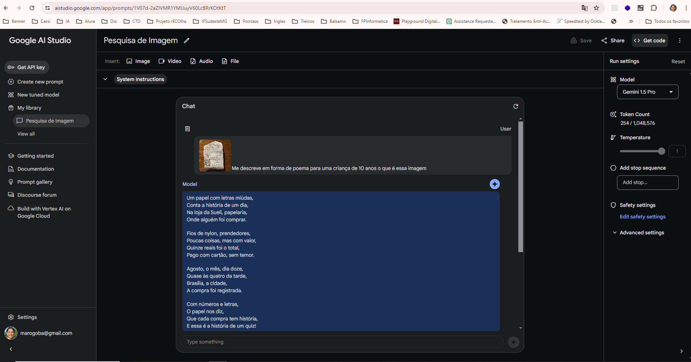

# Gemini
Atividades desenvolvidas no Gemini participando da Imersão Inteligência Artificial 2ª Edição.

### Sobre mim

Experiência em Análise de negócio e sistemas voltado para a área de Operadoras de Planos de Saúde, principalmente trabalhando com o sistema Benner Saúde. Atualmente, lidero uma equipe com quatro programadores e uma tester realizando implementações para o Processamento de Contas Médicas no sistema da Cassi (Plano de Saúde do Banco do Brasil). Coordeno e organizo as Sprints da equipe, participando das análises técnicas, desenvolvimento, testes, entregas e homologação.
Cursando a pós-graduação em Inteligência Artificial Aplicada pela Universidade Federal do Paraná.

### Conecte-se comigo

### Habilidades

## Diário
### 06/05/2024
Instrução: **"Me descreve em forma de poema para uma criança de 10 anos o que é essa imagem"**

Instrução: **Crie um resumo com o arquivo de histórico de acessos aos sites, categorizando por tipo de site, quantidade de uso utilizando a linguagem Markdown para ser exibido no github**

### Resumo do Histórico de Navegação (history.csv)

Este documento apresenta um resumo das atividades de navegação presentes no arquivo \"history.csv\", categorizando os sites acessados e quantificando o uso por categoria. A análise considera os dados até novembro de 2023, respeitando a limitação temporal.

**Metodologia:**

- Os sites foram categorizados manualmente com base em seus domínios e conteúdos.
- A contagem de uso considera a quantidade de vezes que cada site foi acessado.

**Categorias:**

* **Educação (57 acessos):**
    * UFPR Virtual (23)
    * Alura (19)
    * Notion (6)
    * Edisciplinas USP (4)
    * Kaggle (3)
    * Responde Aí (1)
    * Brasil Escola (1)
	
* **Redes Sociais (733 acessos):**
    * Twitter (601)
    * Instagram (12)
    * Discord (1)
* **Entretenimento (331 acessos):**
    * YouTube (107)
    * Globoplay (99)
    * Wikia Miraculous Ladybug (68)
    * Prime Video (1)
    * AdoroCinema (1)
    * TudoGostoso (1)
* **Notícias (347 acessos):**
    * Metrópoles (277)
    * G1 (75)
    * Correio Braziliense (27)
    * Sul21 (1)
    * Tecmundo (1)
    * O Antagonista (1)
    * O Tempo (1)
    * Estado de Minas (1)
    * UOL (1)
    * Estadão (3)
    * Veja (2)
    * Agência Brasil (9)
* **Governo (102 acessos):**
    * FAC - Secretaria de Cultura e Economia Criativa do DF (44)
    * Gov.br (31)
    * TJDFT (37)
    * STJ (1)
    * Correios (21)
    * Agência Nacional de Saúde Suplementar (14)
* **Ferramentas e Serviços (57 acessos):**
    * Google (28)
    * Google AI Studio (13)
    * Google Meet (12)
    * Google Agenda (4)
    * Microsoft Visual Studio (2)
    * iLovePDF (4)
    * 17TRACK (3)
    * Codepen (2)
    * Reclame Aqui (21)
    * Meu Correios (5)
    * CAS - Correios (1)
    * Shopee (1)
    * RD Saúde (1)
* **Outros (59 acessos):**
    * Benner (133)
    * Hyundai (2)
    * SISCON (42)
    * CASSI (134)
    * McAfee (15)
    * TIM (2)
    * Cademi (16)
    * Vick Alves (39)
    * MeuGrupo VIP (1)
    * Frango no Pote (6)
    * Espaço Vital (2)
    * PopTime (3)
    * Uber (2)
    * Lolja (1)
    * Uma Penca (1)
    * DIO (3)
    
**Observações:**

* A categoria \"Outros\" engloba sites de diversas naturezas que não se encaixaram nas demais categorias.
* Alguns sites foram acessados múltiplas vezes dentro de um curto período, possivelmente devido a atualizações ou problemas de conexão.

**Conclusão:**

A análise do histórico de navegação demonstra um uso predominante de **redes sociais e sites de entretenimento**, seguido por **sites de notícias e plataformas educacionais**. Isso sugere um interesse por informação, aprendizado e conexão social, além de momentos de lazer e entretenimento.

